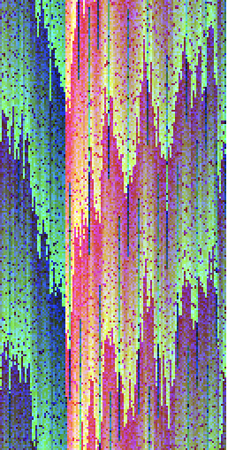

# Display All Colours in Image

This project is for EHG Developer interview process. The problem statement is to generate an image in which each colour occurs exactly once with no repetition.

The approach was to generate different set of colours and save them in a Set collection to be unique. After that saving those distinct colors in an array and sorting them and display them. I have transformed the image to be rotated 90 degrees for a different effect. You can refresh the page to get different set of colours image.

This is developed using React.

## Image

If we look closely, the image visualizes many buildings of different sizes (something like skyscraper buildings) [https://www.shainblumphoto.com/project/cityscape-photography/shang1_1200-3/](https://www.shainblumphoto.com/project/cityscape-photography/shang1_1200-3/)

# How to run the project

No external dependencies are required to be installed.
I have already built the project for production level usage. You will need to run the command

### `npm install`

to install all the dependencies needed for the project as I have removed the node_modules folder from the zip that contains this project.

### `serve -s build`

in the root directory of the project and then visit: [http://localhost:5000](http://localhost:5000)
for the optimized version of the project

## Available Scripts

In the project directory, you can run:

### `npm start`

Runs the app in the development mode.\
Open [http://localhost:3000](http://localhost:3000) to view it in the browser.

### `npm test`

For this project, only a single test is written in the file App.test.js for accessing the text written inside the App.

It checks if the text exists. It takes about 7 seconds to run the test.

### `npm run build`

This is to create a production build.
